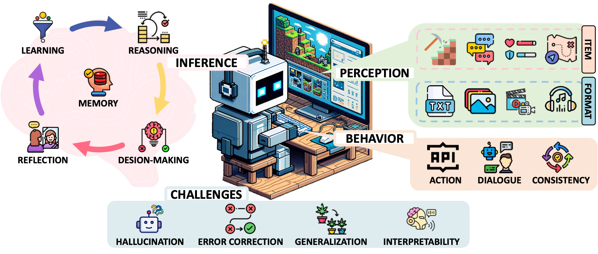
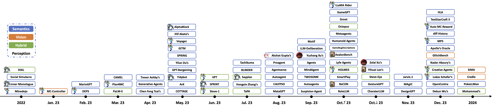
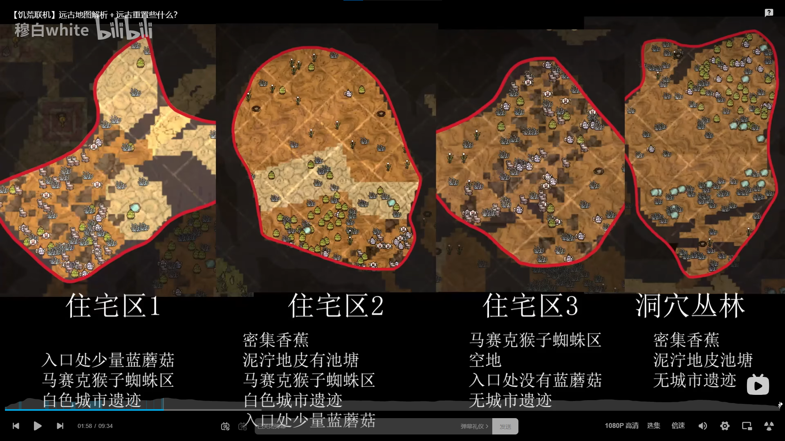
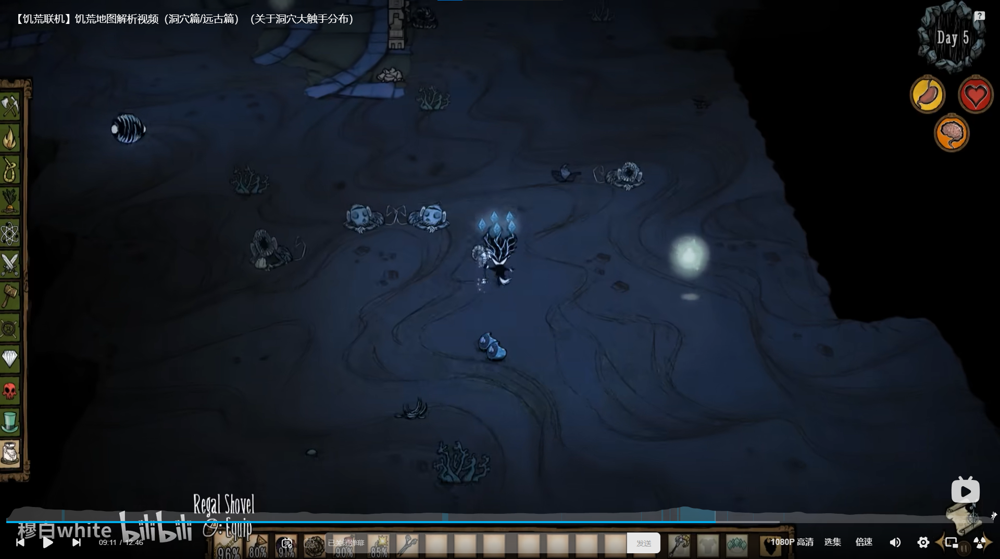

# GPT4DST Weekly Meeting

- Date: 2024.03.25(Mon.)

---

## Agenda

### Introduction to Team

### Project Updates & Problems

### Report on [`A Survey on Game Playing Agents`](https://arxiv.org/abs/2403.10249)

### Q&A Session

---

### Updates

1. Add demo of mod in DST as `mod` folder in project
2. ...

### Problems/Solutions

1. Delay in HTTP response causing real-time interaction to be unavailable(solution: streaming output for LLM)
2. ...

---

## [A Survey on Game Playing Agents](https://arxiv.org/abs/2403.10249)

- Title: A Survey on Game Playing Agents and Large Models: Methods, Apllications, and Challenges(CAS, PKU;2024)
- Journal: ~~arXiv~~
- GitHub: https://github.com/BAAI-Agents/GPA-LM

---

## Abstract

- **Key Focus:** Large-scale Models (LMs) in gaming
- **Advancements:** Notable achievements in NLP, CV, Robotics
- **Aim:** Systematic review of LM usage in complex games
- **Objective:** Clear understanding and interest in impactful research

{ width=50% }

---

## Introduction

- **Significance:** LMs as agents for complex tasks
- **Application:** Games like Minecraft for dynamic environment handling
- **AGI Research:** Digital games as benchmarks for advanced reasoning

MC Video Demo： https://mindagent.github.io/ | https://github.com/CraftJarvis/MC-Planner

---

## Perception in Gaming

- **Semantics**
  - Basic text:  simple user ideas or descriptions and basic game state variables and dialogues
  - Structured/role-based: character, story, role-related information and skills 
  - Environmental/context-specific: detailed game descriptors and contextual information and natural language instructions for tasks
  - Advanced multi-modal inputs: visual, audible, and textual data for decision-making and the combination of dialogue, game state, and scripts for richer interaction
- ~~Vision: VPT~~

---

~~## Inference in Agents~~

- **Cognitive Framework:** Adaptable to various contexts
- **Memory:** Efficient storage and retrieval for common sense
- **Learning:** Skill acquisition and strategic adaptation
- **Reasoning:** Problem-solving through information processing

---

~~## Action Execution~~

- **Interaction:** Agent's response to game state and environment
- **Behavior:** Generative coding techniques used
- **Dialogue:** Agent-agent and human-agent communications
- **Consistency:** Maintained through feedback and reinforcement

---

## Challenges in LMAs

- **Hallucinations:** Erroneous outputs from LMs
- **Error Correction:** Iterative learning and feedback mechanisms
- **Generalization:** Applying learnt knowledge to unseen tasks
- **Interpretability:** Transparent decision-making processes

---

## Future Research Directions

- ~~**Multi-Modal Perception:** Enhancing visual and auditory perceptions~~
- **Authentic Gaming:** Improving narrative generation and character simulation
- **External Tools:** Dynamic access and interpretation of online guides
- **Real-Time Gaming:** Improving efficiency and reaction times

---

## Case Study of GPT4DST: Guidance for Task Recognition

---

## Residential in Game

---

## Guidance (Real-Time Teaching)

---

## Discussion

Knowledge: Q-A Pairs(best)

Dataset (AI)->  Q-A (DST Benchmark)

FastAPI