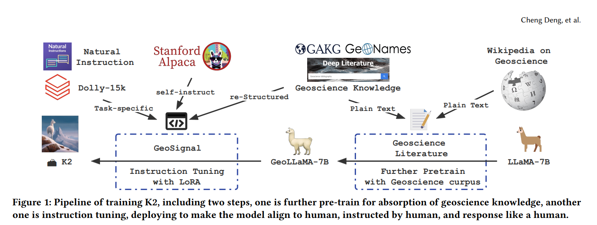

# GPT4DST Weekly Meeting

- Date: 2024.03.31(Sun.)

---

## Agenda

### Architecture of GPT4DST

### Report on `DST Knowledge Dataset Pipeline`

### Q&A Session (Tasks Timeline)

---

### Refer to DATA COLLECTION AND CURATION in `K2`

> Ref: [【Paper】K2: A Foundation Language Model for Geoscience Knowledge Understanding and Utilization](https://arxiv.org/abs/2306.05064)

**Two Steps of Constructing K2:**
Fine-Tuning(right) | Further Pretraining(left)

---

### Architecture of Our Work

INTRODUCTION

RELATED WORK

DATA COLLECTION AND CURATION
> see [dst_data_generation/README.md](../src/dst_data_generation/README.md)

LLM DOMAIN SPECIFIED USING RAG

INTERACTION WITH ENVIRONMENT USING AGENT

~~EVALUATION AND RESULTS~~

CONCLUSION

---

### RELATED WORK

[【Paper】PokeLLMon: A Human-Parity Agent for Pokemon Battles with Large Language](https://arxiv.org/abs/2402.01118)
[【Paper】SPRING: Studying the Paper and Reasoning to Play Games](https://arxiv.org/abs/2305.15486)

---

### MODEL ADAPTION WITH RAG

---

### Q&A Session

**TASKS**
@Sakura @Alan @If @Xinle

- Create Pipeline of covernting codes to QA-Pairs(@Sakura)
- Survey and practise on more RAG techniques(@If @Xinle)
- Deployment project with FastAPI(@Alan)
