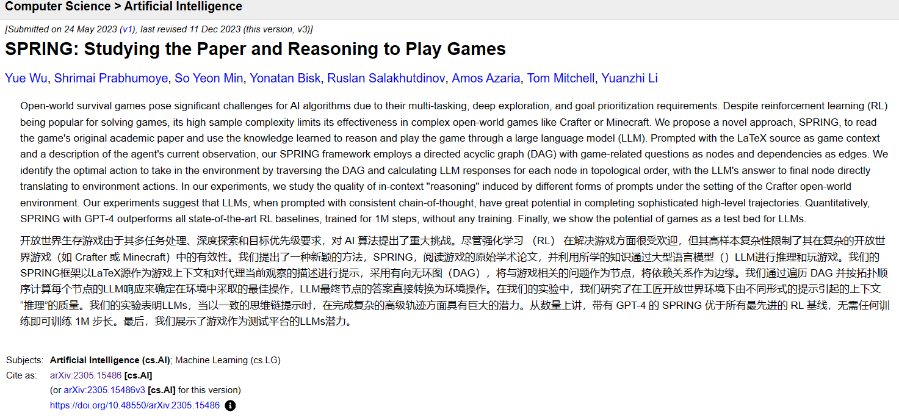
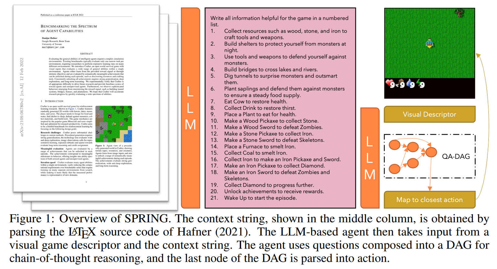
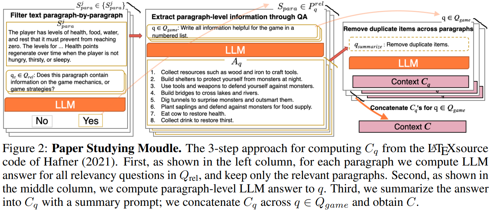
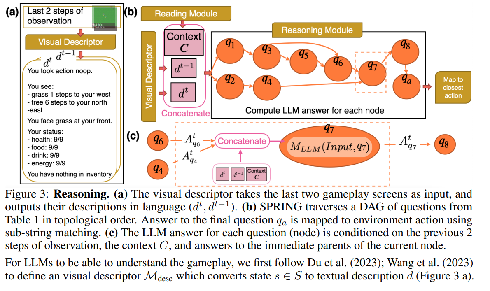
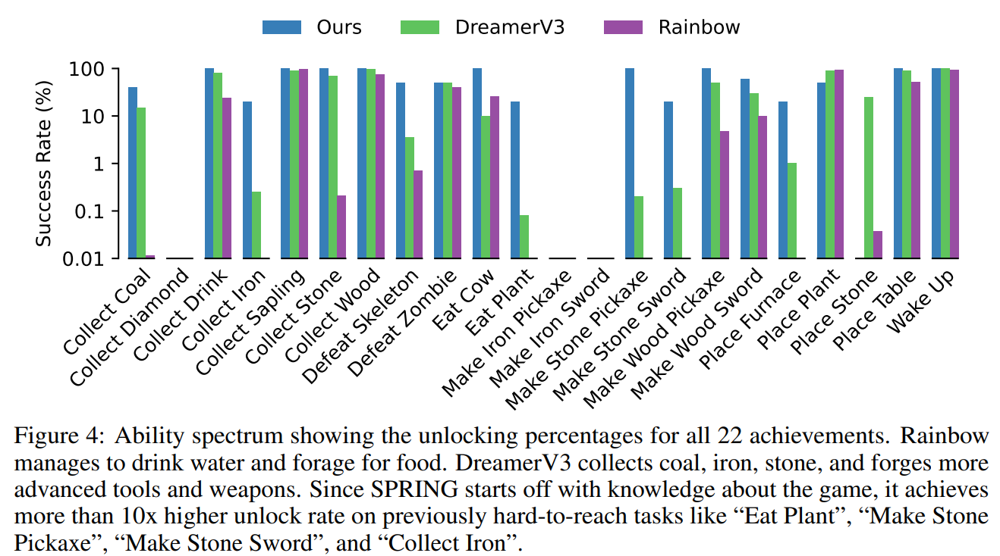

# [SPRING: Studying the Paper and Reasoning to Play Games](https://arxiv.org/abs/2305.15486) (NeurIPS2023)

> GitHub: https://github.com/holmeswww/spring

---

## Overview of `SPRING`

---

## Introduction

### Background

Open-world survival games: Minecraft ([Fan et al., 2022](https://arxiv.org/abs/2206.08853)) and Crafter ([Hafner, 2021]((https://arxiv.org/abs/2109.06780)))

### Challenges

- procedural generation requires strong generalization
- diverse action space requires **multi-task capabilities**
- technology tree requires **long-term planning** and deep exploration
- diverse and conflicting objectives requires **goal prioritization**

---

## Introduction

> Reinforcement learning (RL) has been the go-to approach for game-based problems, with numerous successes in games like Go ([Silver et al., 2017]((https://www.nature.com/articles/nature24270))), robotics ([Fu et al., 2020;](https://arxiv.org/abs/2004.07219) [Hafner et al., 2023](https://arxiv.org/abs/2301.04104)) and various video games ([Vinyals et al., 2019;](https://www.nature.com/articles/s41586-019-1724-z)) ([Schrittwieser et al., 2020;](https://www.nature.com/articles/s41586-020-03051-4) [Badia et al., 2020;](https://arxiv.org/abs/2003.13350)[Hafner et al., 2023](https://arxiv.org/abs/2301.04104)).

**Limitation of RL: high sample complexity & incompatibility with prior knowledge**

> LLMs serve as a candidate for incorporating prior knowledge and in-context reasoning for game-based problems, particularly when it comes to addressing the aforementioned limitations of RL.
---

## Introduction

### Main Contributions

• SPRING is the first to tackle a competitive RL benchmark by explicitly extracting multiple interactions and tech-tree dependencies directly from an academic paper.
• We are the first to show SOTA performance in a challenging open world game with a zero-shot LLM-based (GPT-4) policy
• We study the quality of in-context “reasoning” induced by different prompts and propose a controlled chain-of-thought prompting through a DAG of questions for decision making.

> Notes: benchmark; interactions; tech-tree; zero-shot; COT; DAG

---

## Method

### Studying the paper: Context from LATEX source

---

## Method: Reasoning

---

## Results and Evaluation: RL Baseline

---

## Results and Evaluation: Overall Results

---

## Related Work

### Paper (Core References)

[Benchmarking the Spectrum of Agent Capabilities](https://arxiv.org/abs/2109.06780)

[Mastering Atari with Discrete World Models](https://arxiv.org/abs/2010.02193)

[Mastering Diverse Domains through World Models](https://arxiv.org/abs/2301.04104)

### Code

SmartPlay: https://github.com/microsoft/SmartPlay
> SmartPlay is a `benchmark` for Large Language Models (LLMs). Uses a variety of games to test various important LLM capabilities as agents. SmartPlay is designed to be easy to use, and to support future development of LLMs.
