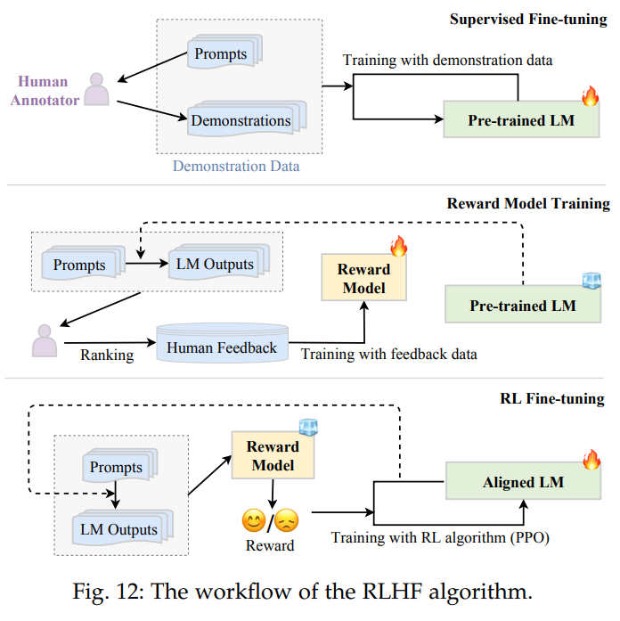

# DST Knowledge Generation from Source Codes

---

## Pipeline Overview

**1. Extracted Knowledge from Codes based on LLM**

**Compared to the distilled knowledge from [WIKI FANDOM](https://dontstarve.fandom.com/wiki/Don%27t_Starve_Together), our knowledge corpus covers `more fields`, contains `more infos` and updates in `real-time`.**

---

- Mobs
    - Attributes(solid data)
        - Health
        - Attack
        - Speed
        - ...
    - Behaviours & Brains(description text)
    - StageGraph(solid data)
- Food & Recipe(solid data)
- Crafting(solid data)
- Structures(solid data)
- Mechenism(description text)
    - Freezing
    - ...
- Characters(solid data)
- Map(solid data)
    > Ref: [【专栏】破解饥荒联机版地形之谜——从代码角度带你读懂饥荒](https://www.bilibili.com/read/cv25349359/) | [【视频】破解饥荒联机版地形之谜——从代码角度带你读懂饥荒](https://www.bilibili.com/video/BV1QV411V7bN)
    - Levels
    - Tasksets
    - Static_layouts
    - Tasks
    - Rooms

---

**2. Formatted Knowledge into Question-Answer Pairs**
> Ref: [【论文】K2: A Foundation Language Model for Geoscience Knowledge Understanding and Utilization](https://arxiv.org/abs/2306.05064) | [【代码】K2: A Foundation Language Model for Geoscience Knowledge Understanding and Utilization](https://github.com/davendw49/k2)

---

```json
//dstsignal_demo.json
[
    {
        Quesition:"What is the health of spider?",
        Answer:"100",
        Category:"health", // Mobs.Attributes.Health
    },
    {   
        ...
    },
    ...
]
```

---

**3. Reinforcement Learning Human Feedback**
> Evaluate part results and let LLM correct it self.

**Question:Is it able to do with OpenAI API, or we need deploy an open-source LLM?**



---

## Techniques

**1. Extracted Knowledge from Codes based on LLM**


> Ref: [OpenAI Pricing](https://openai.com/pricing)

- Foundation Model(FM):  
  - gpt-4-32k(32k)
  - gpt-4-turbo(12k)
  - gpt-4(4k)
  - gpt-3.5-turbo-0125(16k)
  - gpt-3.5-turbo-instruct(4k)
  - gpt-3.5-turbo(4k)

---

**1. Extracted Knowledge from Codes based on LLM**

```python
prompt="""
This is the source cods of Game Don't Starve Together, \
which is written in LUA. You work is to extract core info\
from the codes. Your answer should formatted in dictionary \
followed the format instructions.
---
Source Codes:{codes}
Format Instructions:{format_instructions}
---
"""
```

---

**1. Extracted Knowledge from Codes based on LLM**

```json
//dstknowledge_demo.json
[
    {
        Source:"data\\sourceCodes\\prefabs\\spider.lua", 
        Category:"mods",
        Knowledge:{
            Health:100,
            Attack:10,
            ...
        }
    },
    {   
        ...
    },
    ...
]
```